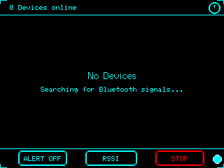

# xXCYD-BLE-BOT-SCANXx

Passive Bluetooth scanner for CYD (Cheap Yellow Display) — detects nearby "BLE" devices and displays them in a live device list.



## Features

- **BLE scanning** — continuous passive scan with RSSI signal bars
- **Live device list** — auto-updating list with signal strength, device name, MAC address, and type
- **Shield mode** — alerts when new/unknown devices appear
- **OUI manufacturer lookup** — identifies 170+ manufacturers across 50+ brands (Apple, Samsung, Google, Sony, Nintendo, etc.)
- **3-button control** — ALERT toggle, SORT cycle, SCAN/STOP
- **9 theme colors** — CYAN, GREEN, RED, ORANGE, YELLOW, GRAY, PURPLE, PINK, WHITE
- **Both CYD board variants** — 1USB (ESP32-32E) and 2USB with auto-calibration
- **Deep sleep** — power ring (top-right) with touch-to-wake

## Hardware

- CYD 2.8" (ESP32 + ILI9341 display)
- No WiFi/internet needed — standalone BLE scanner
- Touch navigation

## Building

```bash
# 1USB version (ESP32-32E)
pio run -e cyd_ble_bot_scan

# 2USB version
pio run -e cyd_ble_bot_scan_2usb
```

Merged firmware binaries are output to `CYD-BLE-BOT-SCAN-1usb.bin` / `CYD-BLE-BOT-SCAN-2usb.bin`.

## Screenshot

```bash
# Double-click, or:
python screenshot.py COM11 Screenshots\screen.bmp
```

## Bottom Bar

| Button | Function |
|---|---|
| `[ALERT OFF/ON]` | Toggle shield — alerts on new devices |
| `[RSSI/NAME/TYPE/NEW]` | Cycle sort mode |
| `[SCAN/STOP]` | Start/stop BLE scanning |
| ● (lower-right dot) | Cycle theme color (9 colors) |

## Serial Protocol

| Command | Response |
|---|---|
| `R` | `READY` |
| `S` | `RGB332:<screen data>` screenshot |
| `M` | Cycle display MADCTL (2USB only) |
| `T` | Cycle touch rotation (2USB only) |

## Credits

Built by xXQuantum-SmokeXx, with development assistance from Claude Code.

OUI lookup table and shield/alert concept adapted from [RamboRogers/esp32-bluetooth-scanner](https://github.com/RamboRogers/esp32-bluetooth-scanner) by Matthew Rogers (MIT License).
